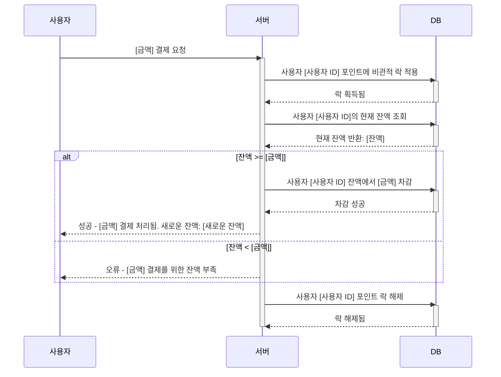

```mermaid
sequenceDiagram
    participant 사용자
    participant 서버
    participant DB

%% 사용자가 결제를 시작함
    사용자->>서버: [금액] 결제 요청
    activate 서버

%% 서버가 사용자의 포인트 테이블에 비관적 락을 적용함
    서버->>DB: 사용자 [사용자 ID] 포인트에 비관적 락 적용
    activate DB
    DB-->>서버: 락 획득됨
    deactivate DB

%% 서버가 사용자의 잔액을 확인함
    서버->>DB: 사용자 [사용자 ID]의 현재 잔액 조회
    activate DB
    DB-->>서버: 현재 잔액 반환: [잔액]
    deactivate DB

%% 결정 포인트: 잔액이 충분한가?
    alt 잔액 >= [금액]
    %% 충분한 잔액: 결제 진행
        서버->>DB: 사용자 [사용자 ID] 잔액에서 [금액] 차감
        activate DB
        DB-->>서버: 차감 성공
        deactivate DB

        서버-->>사용자: 성공 - [금액] 결제 처리됨. 새로운 잔액: [새로운 잔액]
    else 잔액 < [금액]
    %% 잔액 부족: 결제 실패
        서버-->>사용자: 오류 - [금액] 결제를 위한 잔액 부족
    end

%% 서버가 락을 해제함
    서버->>DB: 사용자 [사용자 ID] 포인트 락 해제
    activate DB
    DB-->>서버: 락 해제됨
    deactivate DB
    deactivate 서버
```