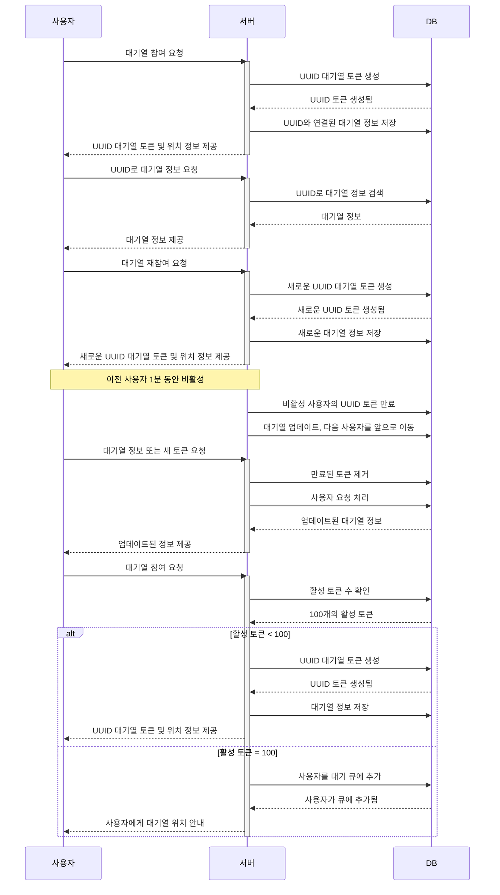

# Queue System Sequence Diagram

```mermaid
sequenceDiagram
    participant 사용자
    participant 서버
    participant DB

%% 사용자가 처음으로 대기열에 참여
    사용자->>서버: 대기열 참여 요청
    activate 서버
    서버->>DB: UUID 대기열 토큰 생성
    DB-->>서버: UUID 토큰 생성됨
    서버->>DB: UUID와 연결된 대기열 정보 저장
    서버-->>사용자: UUID 대기열 토큰 및 위치 정보 제공
    deactivate 서버

%% 사용자가 대기열 정보 확인
    사용자->>서버: UUID로 대기열 정보 요청
    activate 서버
    서버->>DB: UUID로 대기열 정보 검색
    DB-->>서버: 대기열 정보
    서버-->>사용자: 대기열 정보 제공
    deactivate 서버

%% 사용자가 다시 대기열에 참여 (새로운 위치 받음)
    사용자->>서버: 대기열 재참여 요청
    activate 서버
    서버->>DB: 새로운 UUID 대기열 토큰 생성
    DB-->>서버: 새로운 UUID 토큰 생성됨
    서버->>DB: 새로운 대기열 정보 저장
    서버-->>사용자: 새로운 UUID 대기열 토큰 및 위치 정보 제공
    deactivate 서버

%% 이전 사용자의 비활성으로 인한 비활성화
    Note over 사용자,서버: 이전 사용자 1분 동안 비활성
    서버->>DB: 비활성 사용자의 UUID 토큰 만료
    서버->>DB: 대기열 업데이트, 다음 사용자를 앞으로 이동

%% 만료된 토큰은 사용자 요청 시 제거됨
    사용자->>서버: 대기열 정보 또는 새 토큰 요청
    activate 서버
    서버->>DB: 만료된 토큰 제거
    서버->>DB: 사용자 요청 처리
    DB-->>서버: 업데이트된 대기열 정보
    서버-->>사용자: 업데이트된 정보 제공
    deactivate 서버

%% 최대 100개의 활성 토큰에 도달했을 때
    사용자->>서버: 대기열 참여 요청
    activate 서버
    서버->>DB: 활성 토큰 수 확인
    DB-->>서버: 100개의 활성 토큰
    alt 활성 토큰 < 100
        서버->>DB: UUID 대기열 토큰 생성
        DB-->>서버: UUID 토큰 생성됨
        서버->>DB: 대기열 정보 저장
        서버-->>사용자: UUID 대기열 토큰 및 위치 정보 제공
    else 활성 토큰 = 100
        서버->>DB: 사용자를 대기 큐에 추가
        DB-->>서버: 사용자가 큐에 추가됨
        서버-->>사용자: 사용자에게 대기열 위치 안내
    end
    deactivate 서버
```