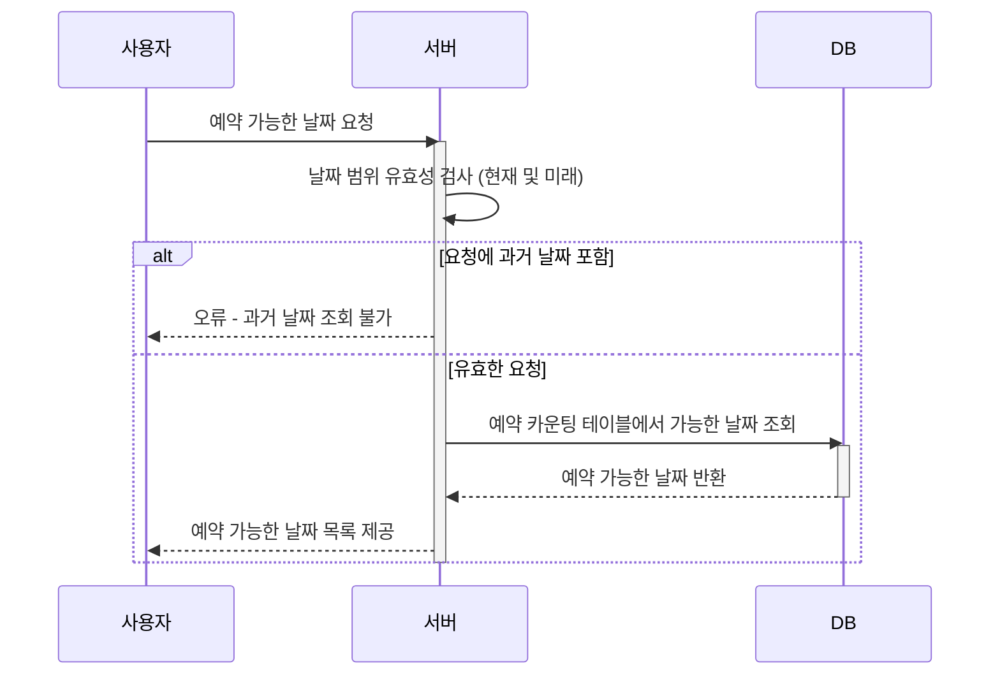

```mermaid
sequenceDiagram
    participant 사용자
    participant 서버
    participant DB

%% 사용자가 예약 가능한 날짜 요청
    사용자->>서버: 예약 가능한 날짜 요청
    activate 서버
    서버->>서버: 날짜 범위 유효성 검사 (현재 및 미래)
    alt 요청에 과거 날짜 포함
        서버-->>사용자: 오류 - 과거 날짜 조회 불가
    else 유효한 요청
        서버->>DB: 예약 카운팅 테이블에서 가능한 날짜 조회
        activate DB
        DB-->>서버: 예약 가능한 날짜 반환
        deactivate DB
        서버-->>사용자: 예약 가능한 날짜 목록 제공
    end
    deactivate 서버
```