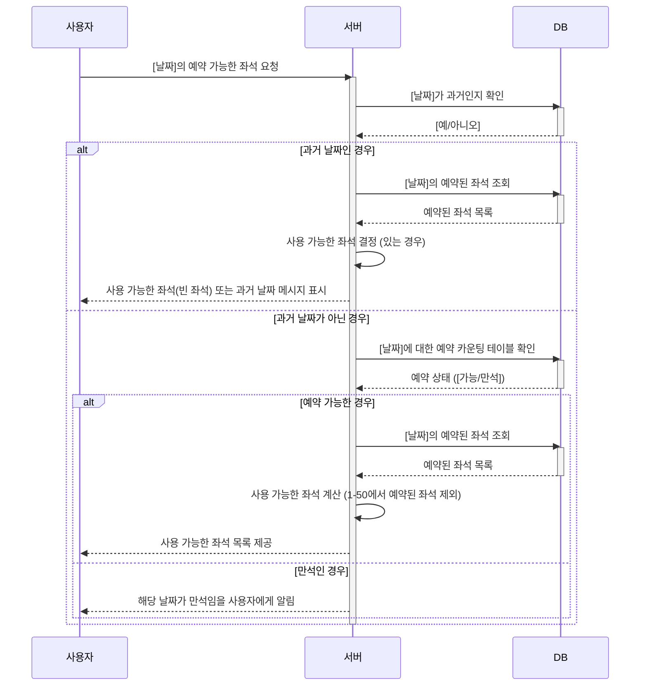

```mermaid
sequenceDiagram
    participant 사용자
    participant 서버
    participant DB

%% 사용자가 특정 날짜의 예약 가능한 좌석 요청
    사용자->>서버: [날짜]의 예약 가능한 좌석 요청
    activate 서버

%% 서버가 날짜 유효성 검사
    서버->>DB: [날짜]가 과거인지 확인
    activate DB
    DB-->>서버: [예/아니오]
    deactivate DB

    alt 과거 날짜인 경우
    %% 과거 날짜 처리: 빈 좌석만 표시하거나 예약 불가 메시지 표시
        서버->>DB: [날짜]의 예약된 좌석 조회
        activate DB
        DB-->>서버: 예약된 좌석 목록
        deactivate DB

        서버->>서버: 사용 가능한 좌석 결정 (있는 경우)
        서버-->>사용자: 사용 가능한 좌석(빈 좌석) 또는 과거 날짜 메시지 표시
    else 과거 날짜가 아닌 경우
    %% 날짜가 예약 가능한지 확인
        서버->>DB: [날짜]에 대한 예약 카운팅 테이블 확인
        activate DB
        DB-->>서버: 예약 상태 ([가능/만석])
        deactivate DB

        alt 예약 가능한 경우
        %% 날짜가 예약 가능: 사용 가능한 좌석 조회 및 반환
            서버->>DB: [날짜]의 예약된 좌석 조회
            activate DB
            DB-->>서버: 예약된 좌석 목록
            deactivate DB

            서버->>서버: 사용 가능한 좌석 계산 (1-50에서 예약된 좌석 제외)
            서버-->>사용자: 사용 가능한 좌석 목록 제공
        else 만석인 경우
        %% 날짜가 만석: 좌석 표시하지 않음
            서버-->>사용자: 해당 날짜가 만석임을 사용자에게 알림
        end
    end
    deactivate 서버
```