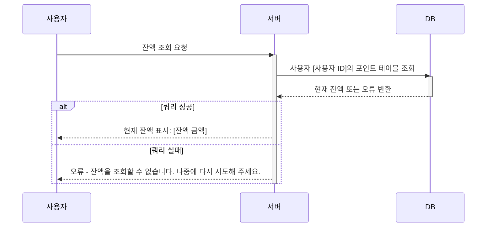

```mermaid
sequenceDiagram
    participant 사용자
    participant 서버
    participant DB

%% 사용자가 잔액 조회를 시작함
    사용자->>서버: 잔액 조회 요청
    activate 서버

%% 서버가 잔액 조회 요청을 처리함
    서버->>DB: 사용자 [사용자 ID]의 포인트 테이블 조회
    activate DB
    DB-->>서버: 현재 잔액 또는 오류 반환
    deactivate DB

%% 결정 포인트: 쿼리가 성공했는가?
    alt 쿼리 성공
    %% 서버가 조회된 잔액으로 사용자에게 응답함
        서버-->>사용자: 현재 잔액 표시: [잔액 금액]
    else 쿼리 실패
    %% 서버가 오류 메시지로 응답함
        서버-->>사용자: 오류 - 잔액을 조회할 수 없습니다. 나중에 다시 시도해 주세요.
    end
    deactivate 서버
```