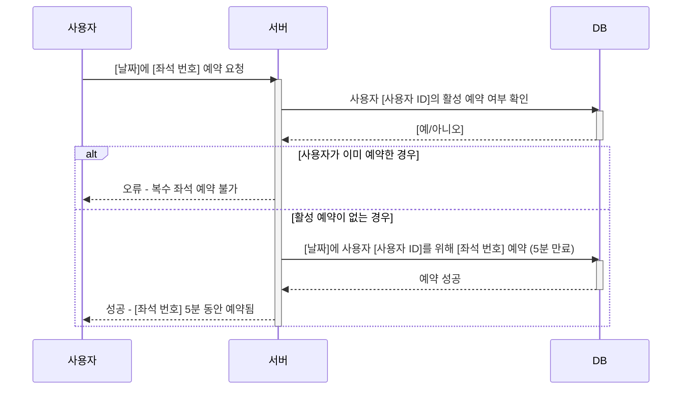

```mermaid
sequenceDiagram
    participant 사용자
    participant 서버
    participant DB

%% 사용자가 좌석 예약을 시도함
    사용자->>서버: [날짜]에 [좌석 번호] 예약 요청
    activate 서버

%% 서버가 사용자의 기존 예약 여부를 확인함
    서버->>DB: 사용자 [사용자 ID]의 활성 예약 여부 확인
    activate DB
    DB-->>서버: [예/아니오]
    deactivate DB

    alt 사용자가 이미 예약한 경우
        서버-->>사용자: 오류 - 복수 좌석 예약 불가
    else 활성 예약이 없는 경우
    %% 서버가 좌석 예약을 진행함
        서버->>DB: [날짜]에 사용자 [사용자 ID]를 위해 [좌석 번호] 예약 (5분 만료)
        activate DB
        DB-->>서버: 예약 성공
        deactivate DB

        서버-->>사용자: 성공 - [좌석 번호] 5분 동안 예약됨
    end
    deactivate 서버
```