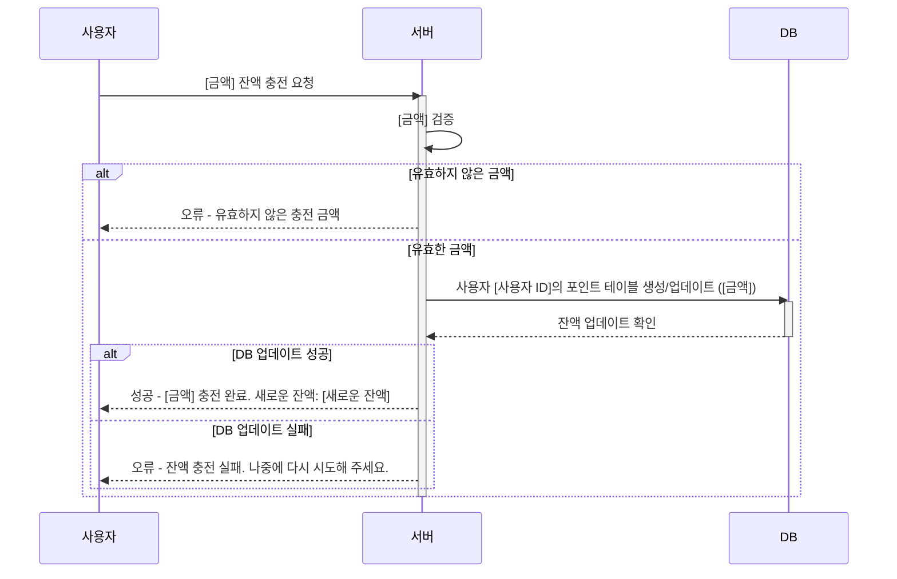

```mermaid
sequenceDiagram
    participant 사용자
    participant 서버
    participant DB

%% 사용자가 잔액 충전을 시작함
    사용자->>서버: [금액] 잔액 충전 요청
    activate 서버

%% 서버가 충전 금액을 검증함
    서버->>서버: [금액] 검증
    alt 유효하지 않은 금액
        서버-->>사용자: 오류 - 유효하지 않은 충전 금액
    else 유효한 금액
    %% 서버가 충전 요청을 처리함
        서버->>DB: 사용자 [사용자 ID]의 포인트 테이블 생성/업데이트 ([금액])
        activate DB
        DB-->>서버: 잔액 업데이트 확인
        deactivate DB

        alt DB 업데이트 성공
        %% 서버가 업데이트된 잔액으로 사용자에게 응답함
            서버-->>사용자: 성공 - [금액] 충전 완료. 새로운 잔액: [새로운 잔액]
        else DB 업데이트 실패
            서버-->>사용자: 오류 - 잔액 충전 실패. 나중에 다시 시도해 주세요.
        end
    end
    deactivate 서버
```